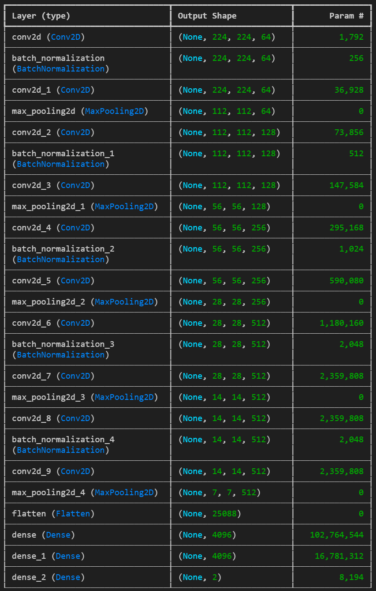
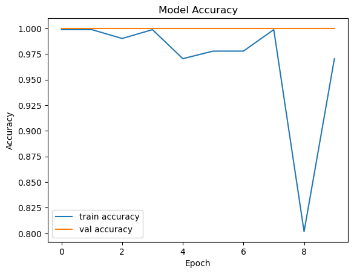
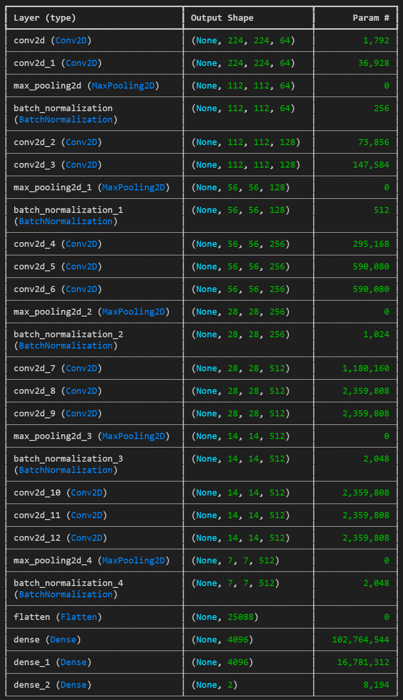

# Project 4 - Skin Cancer Detection Model (CNN Model)

## The problem

Prognoses for skin cancer improve significantly with early diagnoses. Recent advances in image recognition technology have the potential to assist in early diagnosis of skin cancers. Skin cancers are distinct from other malignant tumors in that many of them can be photographed by the patient at home. By analyzing a photograph of the questionable site, software can recommend consulting a doctor if a blemish is likely to be malignant. In this way, developers could design a smart phone app that recommends medical attention in the case of tumors that are likely to be malignant.

## The approach

The team will train a convolutional neural network on a portion of a dataset of 10,000 images. The data includes seven labels, two of which are benign skin conditions and five of which are malignant. We reduced the labels to a binary categorization by simply labeling the images 'benign' or 'malignant.'

Two models were trained.

The first model (Skin_Cancer_Detection_Model JT\skin_cancer_detection_model_jt.ipynb) is summarized as follows:

The model includes 128,964,930 parameteres, 2,944 of which are not trainable.

The model was trained over 10 epochs, achieving a training accuracty of 99.9%. This result cannot simply be accepted however, due to two concerns. One is that the result is too good to be true. One would expect a model of this complexity trained on a dataset of this size to need many more than 10 epochs to reach such a high accuracy. The second is the pattern of accuracy epoch-by-epoch. In the eight epoch, the model showed 99.99% accuracy. This dropped to below 70% accuracy in the ninth epoch and rebounded to 96.79% accuracy in the tenth. That pattern is atypical and raises questions about underlying problems in the model.

The second model (SC_CNN_1.ipynb) is summarized as follows.

This includes 134,274,626 parameters, 2,944 of which are not trainable.

The second model was trained over 50 epochs, acheiving an accuracy of 84%. The second model's training conformed to the expected patterns, raising fewer questions about underlying problems.

## Future Directions

In order to improve the model, several next steps are available.
 - Expanding to a categorical model to sort into all seven categories rather than into 'benign' and 'malignant' may improve accuracy by allowing the model to take into account subtle differences between the varieties of tumors.
 - Training two neural networks to work in conjuntion on the tabular and image data may improve the model.
 - Including sex, age, and localization data might also improve accuracy.

An analysis that includes precision and recall would also be beneficial in this use case. For such an app as dicussed above, a false negative would be much more dangerous than a false positive, since the former might result in a user not seeking medical attention when it is necessary.